<div align="center">

# 🎓✨ EduTrack - Educational Management System ✨🎓


<h3 style="background: linear-gradient(45deg, #667eea 0%, #764ba2 100%); -webkit-background-clip: text; -webkit-text-fill-color: transparent;">
🚀 A comprehensive Educational Management System built with modern web technologies 🚀
</h3>

---

### 🏆 **Project Status & Quality**

[](https://github.com/TechRangers2-0/Codes/actions)
[](LICENSE)
[](https://github.com/TechRangers2-0/Codes/graphs/contributors)
[](https://github.com/TechRangers2-0/Codes/commits)

[](https://github.com/TechRangers2-0/Codes/issues)
[](https://github.com/TechRangers2-0/Codes/stargazers)
[](https://github.com/TechRangers2-0/Codes/network/members)
[](package.json)

---

### 💻 **Technology Stack**

[](https://reactjs.org/)
[](https://vitejs.dev/)
[](https://firebase.google.com/)
[](https://tailwindcss.com/)

[](https://developer.mozilla.org/en-US/docs/Web/JavaScript)
[](https://axios-http.com/)
[](https://reactrouter.com/)
[](https://eslint.org/)

---

### 🌟 **Quick Links**

[](https://github.com/TechRangers2-0/Codes)
[](#-table-of-contents)
[](#-quick-start)
[](#-contributing)

</div>

---

## 📋 Table of Contents

<div align="center">

| 🎯 Core | 🛠️ Setup | 🤝 Community | 📚 Resources |
|:-------:|:--------:|:-----------:|:------------:|
| [🎯 About](#-about) | [🚀 Quick Start](#-quick-start) | [🤝 Contributing](#-contributing) | [❓ FAQ](#-faq) |
| [✨ Features](#-features) | [📖 Installation](#-installation) | [👨‍💻 Team](#-team-members) | [🗺️ Roadmap](#️-roadmap) |
| [🛠️ Tech Stack](#️-tech-stack) | [🎮 Usage](#-usage) | [📄 License](#-license) | [🙏 Acknowledgements](#-acknowledgements) |
| [📸 Screenshots](#-screenshots) | | | |

</div>

---

## 🎯 About

<div align="center">

### 💫 **Welcome to EduTrack** 💫

</div>

**EduTrack** is a modern, comprehensive Educational Management System designed to streamline academic administration and enhance the learning experience. Built with cutting-edge web technologies, EduTrack provides an intuitive platform for managing student records, tracking attendance, and facilitating educational workflows.

<div align="center">

### 🌟 **Why Choose EduTrack?**

<table>
<tr>
<td align="center" width="25%">

<br />
<strong>🔐 Secure Authentication</strong>
<br />
<sub>Firebase-powered authentication with Google Sign-In</sub>
</td>
<td align="center" width="25%">

<br />
<strong>📊 Real-time Analytics</strong>
<br />
<sub>Live attendance tracking and performance monitoring</sub>
</td>
<td align="center" width="25%">

<br />
<strong>🎨 Modern UI/UX</strong>
<br />
<sub>Beautiful, responsive design with TailwindCSS</sub>
</td>
<td align="center" width="25%">

<br />
<strong>⚡ Lightning Fast</strong>
<br />
<sub>Built on Vite for optimal performance</sub>
</td>
</tr>
<tr>
<td align="center" width="25%">

<br />
<strong>📱 Mobile-First</strong>
<br />
<sub>Fully responsive design for all devices</sub>
</td>
<td align="center" width="25%">

<br />
<strong>🔧 Extensible</strong>
<br />
<sub>Modular architecture for easy customization</sub>
</td>
<td align="center" width="25%">

<br />
<strong>🎓 Student-Centric</strong>
<br />
<sub>Designed with students and educators in mind</sub>
</td>
<td align="center" width="25%">

<br />
<strong>🎯 Goal-Oriented</strong>
<br />
<sub>Focus on improving educational outcomes</sub>
</td>
</tr>
</table>

</div>

<div align="center">

### 📈 **Project Statistics**

[](https://github.com/TechRangers2-0/Codes)
[](https://github.com/TechRangers2-0/Codes)
[](https://github.com/TechRangers2-0/Codes)
[](https://github.com/TechRangers2-0/Codes)

</div>

---

## ✨ Features

<div align="center">

### 🚀 **Comprehensive Feature Set**

*Everything you need for modern educational management*

</div>

<table>
<tr>
<td width="50%" valign="top">

### 🎓 **Student Management**
- 🏠 **Student Dashboard**: Comprehensive overview of academic progress
- 📊 **Attendance Tracking**: Real-time monitoring with visual analytics  
- 👤 **Profile Management**: Detailed student profiles with customization
- 📈 **Performance Analytics**: Visual representation of academic data
- 📋 **Course Enrollment**: Easy enrollment and course selection
- 🎯 **Goal Setting**: Personal academic goal tracking

</td>
<td width="50%" valign="top">

### 🔐 **Authentication & Security**
- 🛡️ **Multi-factor Authentication**: Firebase-powered secure login
- 🔗 **Google Sign-In Integration**: Seamless Google account login
- 👥 **Role-based Access Control**: Student, teacher, admin roles
- 🔒 **Secure Data Handling**: Industry-standard security practices
- 🔑 **Password Management**: Secure password reset and recovery
- 🚫 **Access Monitoring**: Real-time security monitoring

</td>
</tr>
<tr>
<td width="50%" valign="top">

### 📊 **Academic Features**  
- 🏫 **Class Management**: Organize multiple classes efficiently
- 📚 **Subject-wise Tracking**: Individual subject performance
- 📊 **Interactive Charts**: Visual analytics for data interpretation
- 📄 **Report Generation**: Automated report creation and export
- 📅 **Schedule Management**: Class schedules and timetables
- 🎯 **Assignment Tracking**: Assignment submission and grading

</td>
<td width="50%" valign="top">

### 🎨 **User Experience**
- 📱 **Responsive Design**: Perfect experience across all devices
- 🌙 **Dark/Light Theme**: Customizable theme preferences
- 🧭 **Intuitive Navigation**: User-friendly interface design
- 🔔 **Toast Notifications**: Real-time feedback and notifications
- ⚡ **Fast Loading**: Optimized performance for quick responses
- 🎯 **Accessibility**: WCAG compliant for inclusive design

</td>
</tr>
</table>

<div align="center">

### 🎯 **Feature Highlights**

[](https://github.com/TechRangers2-0/Codes)
[](https://github.com/TechRangers2-0/Codes)
[](https://github.com/TechRangers2-0/Codes)
[](https://github.com/TechRangers2-0/Codes)

</div>

---

## 🛠️ Tech Stack

<div align="center">

### 💻 **Cutting-Edge Technology Stack**

*Built with the most modern and powerful technologies*

</div>

<table>
<tr>
<td width="50%" valign="top">

### 🎨 **Frontend Technologies**
| Technology | Version | Purpose | Rating |
|------------|---------|---------|--------|
|  | 18.3.1 | UI Library | ⭐⭐⭐⭐⭐ |
|  | 6.0.5 | Build Tool | ⭐⭐⭐⭐⭐ |
|  | 3.4.17 | CSS Framework | ⭐⭐⭐⭐⭐ |
|  | 7.1.3 | Routing | ⭐⭐⭐⭐⭐ |

</td>
<td width="50%" valign="top">

### ☁️ **Backend & Services**
| Technology | Version | Purpose | Rating |
|------------|---------|---------|--------|
|  | 11.2.0 | Backend Services | ⭐⭐⭐⭐⭐ |
|  | 1.7.9 | HTTP Client | ⭐⭐⭐⭐⭐ |

</td>
</tr>
<tr>
<td width="50%" valign="top">

### 🔧 **Development Tools**
| Technology | Version | Purpose | Rating |
|------------|---------|---------|--------|
|  | 9.17.0 | Code Linting | ⭐⭐⭐⭐⭐ |
|  | 8.5.1 | CSS Processing | ⭐⭐⭐⭐⭐ |
|  | 10.4.21 | CSS Vendor Prefixes | ⭐⭐⭐⭐⭐ |

</td>
<td width="50%" valign="top">

### 🎨 **UI Components & Libraries**
- 🎭 **React Icons** - Comprehensive icon library
- 🍞 **React Toastify** - Toast notification system  
- 🧩 **Custom Components** - Reusable UI components
- 🎨 **Custom Hooks** - Efficient state management
- 📱 **Responsive Components** - Mobile-first design
- ♿ **Accessible Design** - WCAG compliant components

</td>
</tr>
</table>

<div align="center">

### 🏗️ **Architecture Overview**

```mermaid
graph TD
    A[🌐 Frontend - React + Vite] --> B[🔥 Firebase Auth]
    A --> C[☁️ Firebase Firestore] 
    A --> D[📡 Axios HTTP Client]
    B --> E[👤 User Management]
    C --> F[📊 Data Storage]
    D --> G[🔗 API Communications]
    A --> H[🎨 TailwindCSS]
    H --> I[📱 Responsive UI]
```



### 🚀 **Performance Metrics**

[](https://github.com/TechRangers2-0/Codes)
[](https://github.com/TechRangers2-0/Codes)
[](https://github.com/TechRangers2-0/Codes)
[](https://github.com/TechRangers2-0/Codes)

</div>

---

## 🚀 Quick Start

Get EduTrack running on your local machine in just a few steps:

```bash
# Clone the repository
git clone https://github.com/TechRangers2-0/Codes.git

# Navigate to project directory
cd Codes

# Install dependencies
npm install

# Start development server
npm run dev

# Open your browser and navigate to http://localhost:5173
```

---

## 📖 Installation

### Prerequisites

Before you begin, ensure you have the following installed:

- **Node.js** (v18.0.0 or higher) - [Download here](https://nodejs.org/)
- **npm** (v8.0.0 or higher) - Comes with Node.js
- **Git** - [Download here](https://git-scm.com/)

### Step-by-Step Installation

1. **Clone the Repository**
   ```bash
   git clone https://github.com/TechRangers2-0/Codes.git
   cd Codes
   ```

2. **Install Dependencies**
   ```bash
   npm install
   ```

3. **Environment Setup**
   ```bash
   # Create environment file (if needed)
   cp .env.example .env.local
   
   # Add your Firebase configuration
   # VITE_FIREBASE_API_KEY=your_api_key
   # VITE_FIREBASE_AUTH_DOMAIN=your_auth_domain
   # VITE_FIREBASE_PROJECT_ID=your_project_id
   ```

4. **Development Server**
   ```bash
   npm run dev
   ```

5. **Production Build**
   ```bash
   npm run build
   npm run preview
   ```

### Docker Installation (Optional)

```dockerfile
# Use official Node.js runtime as base image
FROM node:18-alpine

# Set working directory
WORKDIR /app

# Copy package files
COPY package*.json ./

# Install dependencies
RUN npm install

# Copy source code
COPY . .

# Build application
RUN npm run build

# Expose port
EXPOSE 5173

# Start application
CMD ["npm", "run", "preview"]
```

---

## 🎮 Usage

### Basic Navigation

1. **Home Page**: Overview of the EduTrack system
2. **Student Dashboard**: Access student-specific features
3. **Authentication**: Sign up or log in to access personalized features
4. **Profile Management**: Update and manage user profiles

### Key Workflows

#### For Students
```javascript
// Access student dashboard
Navigate to /StuDashboard

// View attendance
Check attendance charts for each subject

// Update profile
Navigate to profile section and modify information
```

#### For Administrators
```javascript
// Manage classes
Navigate to /classForm

// View student details
Access /stuDetailPage for comprehensive student information

// Monitor system analytics
Use dashboard analytics for insights
```

### API Integration

```javascript
// Example: Fetching student data
import axios from 'axios';

const getStudentData = async (studentId) => {
  try {
    const response = await axios.get(`/api/students/${studentId}`);
    return response.data;
  } catch (error) {
    console.error('Error fetching student data:', error);
  }
};
```

---

## 📸 Screenshots

<div align="center">

### 🏠 Home Page
*Modern landing page with gradient design and clear navigation*

### 📊 Student Dashboard
*Interactive dashboard with attendance tracking and performance analytics*

### 🔐 Authentication
*Secure login system with Firebase and Google Sign-In integration*

### 📱 Mobile View
*Fully responsive design optimized for mobile devices*

</div>

---

## 🤝 Contributing

We welcome contributions from the community! Here's how you can help make EduTrack better:

### 📋 Contribution Guidelines

1. **Fork the Repository**
   ```bash
   # Click the 'Fork' button on GitHub
   git clone https://github.com/YOUR-USERNAME/Codes.git
   ```

2. **Create a Feature Branch**
   ```bash
   git checkout -b feature/amazing-feature
   ```

3. **Make Your Changes**
   - Follow the existing code style
   - Add tests for new features
   - Update documentation as needed

4. **Commit Your Changes**
   ```bash
   git commit -m "✨ Add amazing feature"
   ```

5. **Push to Your Branch**
   ```bash
   git push origin feature/amazing-feature
   ```

6. **Open a Pull Request**
   - Provide a clear description of your changes
   - Reference any related issues
   - Ensure all tests pass

### 🎯 Areas for Contribution

- 🐛 **Bug Fixes**: Help us squash bugs
- ✨ **New Features**: Implement requested features
- 📚 **Documentation**: Improve documentation
- 🎨 **UI/UX**: Enhance user experience
- ⚡ **Performance**: Optimize application performance
- 🧪 **Testing**: Add or improve tests

### 📝 Code Style

- Use **ESLint** configuration provided
- Follow **React** best practices
- Use **TailwindCSS** for styling
- Write meaningful commit messages
- Add comments for complex logic

### 🐛 Reporting Bugs

Found a bug? Please help us fix it:

1. Check if the bug is already reported in [Issues](https://github.com/TechRangers2-0/Codes/issues)
2. Create a new issue with:
   - Clear description of the bug
   - Steps to reproduce
   - Expected vs actual behavior
   - Screenshots (if applicable)
   - Environment details

---

## 📄 License

This project is licensed under the **MIT License** - see the [LICENSE](LICENSE) file for details.

```
MIT License

Copyright (c) 2024 TechRangers2-0

Permission is hereby granted, free of charge, to any person obtaining a copy
of this software and associated documentation files (the "Software"), to deal
in the Software without restriction, including without limitation the rights
to use, copy, modify, merge, publish, distribute, sublicense, and/or sell
copies of the Software, and to permit persons to whom the Software is
furnished to do so, subject to the following conditions:

The above copyright notice and this permission notice shall be included in all
copies or substantial portions of the Software.
```

---

## 👨‍💻 Team Members

<div align="center">

### 🏆 Meet Our Amazing Team
*Passionate developers building the future of education technology*

---

<table align="center">
<tr>
<td align="center" width="200px">

<br />
<strong>🚀 Hari Haran</strong>
<br />
<sub><em>Lead Developer & Project Architect</em></sub>
<br />
<a href="https://github.com/Hari-hara7">

</a>
<br />
<sub>💡 React Specialist | 🔥 Firebase Expert | ⚡ Performance Optimizer</sub>
</td>
<td align="center" width="200px">

<br />
<strong>💎 Anup Kumar</strong>
<br />
<sub><em>Full-Stack Developer & UI/UX Designer</em></sub>
<br />
<a href="https://github.com/CodeAnup">

</a>
<br />
<sub>🎨 Design Guru | 📱 Mobile First | 🛠️ Code Craftsman</sub>
</td>
<td align="center" width="200px">

<br />
<strong>⭐ Krithika Raviraj</strong>
<br />
<sub><em>Backend Developer & Database Architect</em></sub>
<br />
<a href="https://github.com/KrithikaRaviraj">

</a>
<br />
<sub>🗄️ Database Master | 🔐 Security Expert | 📊 Analytics Pro</sub>
</td>
</tr>
</table>

---

### 🤖 Our AI Assistants
<table align="center">
<tr>
<td align="center" width="150px">

<br />
<strong>🔧 Dependabot</strong>
<br />
<sub><em>Dependency Guardian</em></sub>
<br />
<sub>🛡️ Security Updates | 📦 Package Manager</sub>
</td>
<td align="center" width="150px">

<br />
<strong>🤖 GitHub Copilot</strong>
<br />
<sub><em>Code Assistant</em></sub>
<br />
<sub>💭 AI Pair Programming | 🚀 Productivity Booster</sub>
</td>
</tr>
</table>

---

### 🌟 Team Stats & Fun Facts

<div align="center">

[](https://github.com/TechRangers2-0/Codes/graphs/contributors)
[](https://github.com/TechRangers2-0/Codes/commits)
[](https://github.com/TechRangers2-0/Codes)

</div>

<details>
<summary><strong>🎯 Team Achievements</strong></summary>

- 🏗️ **Architecture Excellence**: Built a scalable educational management system from ground up
- 🎨 **Design Innovation**: Created intuitive user interfaces with modern design principles  
- 🔒 **Security First**: Implemented robust authentication and data protection
- 📱 **Responsive Design**: Ensured seamless experience across all devices
- ⚡ **Performance**: Optimized for lightning-fast load times and smooth interactions
- 🤝 **Collaboration**: Maintained excellent code quality through peer reviews and best practices

</details>

### 💬 Join Our Team

<div align="center">

**Interested in contributing?** We're always looking for passionate developers! 

[](https://github.com/TechRangers2-0/Codes/issues)
[](https://github.com/TechRangers2-0/Codes/issues?q=is%3Aissue+is%3Aopen+label%3A%22good+first+issue%22)

</div>

</div>

### 📧 Contact Information

- 📮 **Email**: [contact@techrangers.dev](mailto:contact@techrangers.dev)
- 🐦 **Twitter**: [@TechRangers20](https://twitter.com/TechRangers20)
- 💼 **LinkedIn**: [TechRangers2-0](https://linkedin.com/company/techrangers2-0)
- 🌐 **Website**: [www.techrangers.dev](https://www.techrangers.dev)

---

## 🗺️ Roadmap

### 🎯 Current Goals (Q1 2024)

- [x] ✅ Core authentication system
- [x] ✅ Student dashboard implementation
- [x] ✅ Attendance tracking functionality
- [ ] 🔄 Advanced analytics dashboard
- [ ] 📱 Mobile application development
- [ ] 🔔 Real-time notifications

### 🚀 Future Plans (Q2-Q4 2024)

- [ ] 🎓 **Teacher Portal**: Comprehensive teacher management system
- [ ] 📊 **Advanced Analytics**: ML-powered insights and predictions
- [ ] 💬 **Communication Hub**: Integrated messaging and announcements
- [ ] 📚 **Learning Management**: Course content and assignment management
- [ ] 🔌 **API Development**: Public API for third-party integrations
- [ ] 🌍 **Internationalization**: Multi-language support
- [ ] ☁️ **Cloud Integration**: Enhanced cloud storage and backup
- [ ] 🤖 **AI Features**: Intelligent recommendations and automation

### 💭 Long-term Vision

- **🌟 Industry Standard**: Become the go-to educational management platform
- **🔗 Ecosystem Integration**: Seamless integration with educational tools
- **🌍 Global Reach**: Support educational institutions worldwide
- **🚀 Innovation Hub**: Pioneer new educational technologies

---

## ❓ FAQ

<details>
<summary><strong>🔧 How do I set up Firebase for this project?</strong></summary>

1. Create a Firebase project at [Firebase Console](https://console.firebase.google.com/)
2. Enable Authentication and Firestore
3. Copy your configuration and add to environment variables
4. Enable Google Sign-In in Authentication settings

</details>

<details>
<summary><strong>📱 Is EduTrack mobile-friendly?</strong></summary>

Yes! EduTrack is built with a mobile-first approach using TailwindCSS. It works seamlessly across all devices and screen sizes.

</details>

<details>
<summary><strong>🔄 How often is the project updated?</strong></summary>

We actively maintain EduTrack with regular updates. Check our [GitHub repository](https://github.com/TechRangers2-0/Codes) for the latest commits and releases.

</details>

<details>
<summary><strong>🛠️ Can I customize the UI components?</strong></summary>

Absolutely! The project uses TailwindCSS and modular React components, making customization straightforward. Refer to our [Contributing Guidelines](#-contributing) for best practices.

</details>

<details>
<summary><strong>🔐 Is my data secure with EduTrack?</strong></summary>

Yes, we take security seriously. We use Firebase for authentication and implement industry-standard security practices. All data is encrypted and securely stored.

</details>

<details>
<summary><strong>💰 Is EduTrack free to use?</strong></summary>

Yes, EduTrack is open-source and free to use under the MIT License. You can use, modify, and distribute it according to the license terms.

</details>

---

## 🙏 Acknowledgements

We extend our gratitude to the amazing open-source community and the following projects that make EduTrack possible:

### 🛠️ Core Technologies
- **[React](https://reactjs.org/)** - The foundation of our user interface
- **[Vite](https://vitejs.dev/)** - Lightning-fast build tool and development server
- **[Firebase](https://firebase.google.com/)** - Backend services and authentication
- **[TailwindCSS](https://tailwindcss.com/)** - Utility-first CSS framework

### 📦 Key Dependencies
- **[React Router](https://reactrouter.com/)** - Declarative routing for React
- **[Axios](https://axios-http.com/)** - Promise-based HTTP client
- **[React Icons](https://react-icons.github.io/react-icons/)** - Popular icon library
- **[React Toastify](https://fkhadra.github.io/react-toastify/)** - Notification system

### 🎨 Design Inspiration
- **[Heroicons](https://heroicons.com/)** - Beautiful hand-crafted SVG icons
- **[Shields.io](https://shields.io/)** - Quality metadata badges
- **[GitHub](https://github.com/)** - Platform that hosts our code and collaboration

### 🌟 Special Thanks
- All contributors who have helped improve EduTrack
- The open-source community for continuous inspiration
- Educational institutions that provide feedback and requirements
- Beta testers who help us identify and fix issues

---

<div align="center">

### 🌟 **If you find EduTrack helpful, please consider giving it a star!**

<a href="https://github.com/TechRangers2-0/Codes/stargazers">

</a>

<a href="https://github.com/TechRangers2-0/Codes/network/members">

</a>

<a href="https://github.com/TechRangers2-0/Codes/watchers">

</a>

---

### 💖 **Built with Love by**

<table>
<tr>
<td align="center">

<br />
<strong><a href="https://github.com/TechRangers2-0">🏆 TechRangers2-0</a></strong>
<br />
<sub><em>Empowering education through technology</em></sub>
</td>
</tr>
</table>

---

### 🚀 **Follow Our Journey**

[](https://github.com/TechRangers2-0)
[](https://github.com/TechRangers2-0/Codes/issues)
[](https://github.com/TechRangers2-0/Codes/discussions)
[](https://github.com/TechRangers2-0/Codes/wiki)

---

<h3 style="background: linear-gradient(45deg, #667eea 0%, #764ba2 100%); -webkit-background-clip: text; -webkit-text-fill-color: transparent;">
🎓 "Education is the most powerful weapon which you can use to change the world." - Nelson Mandela 🌍
</h3>

---

### 📊 **Repository Statistics**

<a href="https://github.com/TechRangers2-0/Codes">

</a>

<a href="https://github.com/TechRangers2-0/Codes">

</a>

---

### 🎯 **Quick Actions**

<a href="https://github.com/TechRangers2-0/Codes/fork">

</a>

<a href="https://github.com/TechRangers2-0/Codes/issues/new">

</a>

<a href="#-quick-start">

</a>

---

*Made with ❤️ in India 🇮🇳 | Copyright © 2024 TechRangers2-0 | MIT License*

</div>
